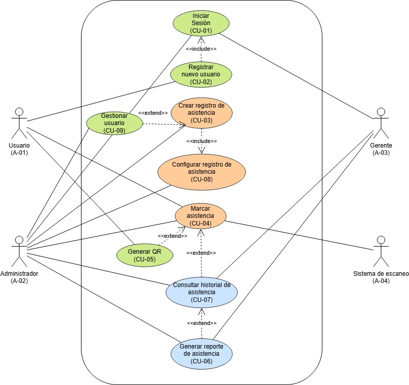

# 📊 Proyecto: Avance de Desarrollo

## 👥 Integrantes del Equipo

- **Cristofer Torres Castillo**
- **Cristian Huaracha Venturas**
- **Winston Apaza Mamani**
- **Diego Sebastian Gonzales Gomez**

---

## 📈 Distribución de la Participación

Cada integrante del equipo ha contribuido de manera igualitaria en las tareas y el desarrollo del proyecto. El porcentaje de participación para cada miembro es el siguiente:

| Integrante                     | Porcentaje | Contribucion                           |
| ------------------------------ | ---------- | -------------------------------------- |
| Cristofer Torres Castillo      | 25%        | Vista principal "home"                 |
| Cristian Huaracha Venturas     | 25%        | Vista del login y nuevo registro       |
| Winston Apaza Mamani           | 25%        | Vista del formulario de registro       |
| Diego Sebastian Gonzales Gomez | 25%        | Backend login y vista de Administrador |

---

## 🚀 Estado Actual del Proyecto

El proyecto se encuentra en proceso, con avances significativos en las siguientes áreas:

- Desarrollo de interfaces graficas responsivas
- Desarrollo de lector de QR
- Desarrollo de login

¡Pronto compartiremos más detalles sobre nuestro progreso!

---

## 🔗 Contacto

Para cualquier consulta o colaboración, no dudes en ponerte en contacto con nosotros a través de nuestros correos electrónicos o plataformas académicas.

---

> **Nota:** Este proyecto es el resultado del esfuerzo colaborativo y el compromiso de todos los miembros del equipo. Continuaremos trabajando para alcanzar los objetivos establecidos en los plazos acordados.
